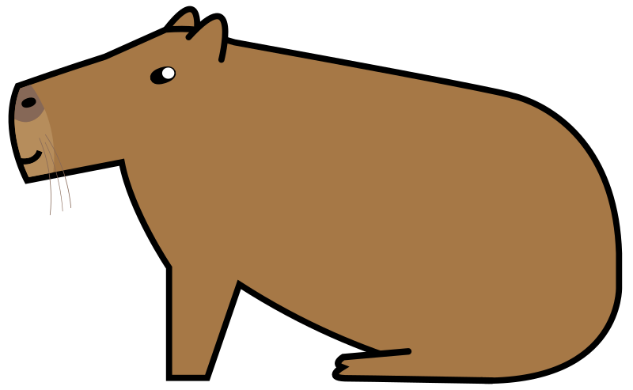

<h1 align="center">Capybara</h1>

</img>
</img>
</img>
</img>
</img>
</img>
</img>

A simple, cross-platform 2D game engine written in Rust, using OpenGL/WebGL as graphics backend. Focused on development speed and ease of use, which makes it suitable for game jams with strict time constraints.

## Main features
 - asynchronous assets loader
 - integration with immediate mode UI
 - flexible particle system with lots of configuration options
 - built-in support for the physics engine and audio system
 - easy web development via [trunk](https://github.com/thedodd/trunk)

## Dependencies
 - graphics: [glow](https://github.com/grovesNL/glow)
 - interface: [egui](https://github.com/emilk/egui)
 - math: [glam](https://github.com/bitshifter/glam-rs)
 - physics: [rapier](https://github.com/dimforge/rapier)
 - sound: [kira](https://github.com/tesselode/kira)

## Supported platforms
 - Windows ([winapi.rs](./capybara-core/src/window/winapi.rs))
 - Linux X11 ([x11.rs](./capybara-core/src/window/x11.rs))
 - Web ([web.rs](./capybara-core/src/window/web.rs))